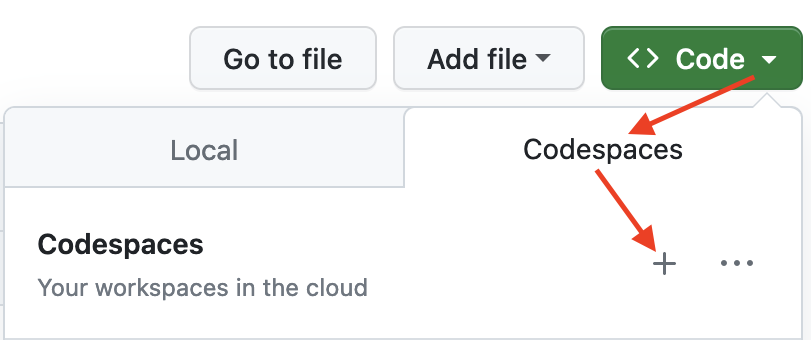
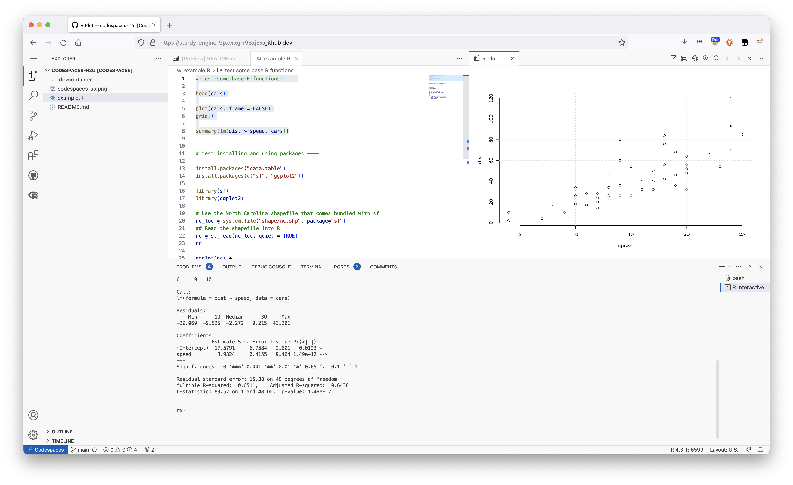

## r2u for Codespaces environments

This directory provides a small self-containted file `devcontainer.json` to
launch an executable environment R using r2u. It is based on the example in
[Grant McDermott's
codespaces-r2u](https://github.com/grantmcdermott/codespaces-r2u) repo and
reuses its documentation. It is driven by the [Rocker Project's Devcontainer
Features](https://rocker-project.org/images/devcontainer/features.html) repo
creating a fully functioning R environment for use in cloud in a few minutes.
And thanks to [r2u](https://eddelbuettel.github.io/r2u/) you can add easily
to this environment by installing new R packages in a fast and failsafe way.

### Try it out

To get started, simply click on the green "Code" button at the top right. Then
select the "Codespaces" tab and click the "+" symbol to start a new Codespace.

The first time you do this, it will open up a new browser tab where your Codespace
is being instantiated. This *first-time instantiation will take a few minutes*
(feel free to click "View logs" to see how things are progressing) so please be patient. 
Once built, your Codespace should deploy almost immediately when you use it again in the future.

Once the VS Code editor opens up in your browser, feel free to open up the [`sfExample.R`](examples/sfExamples.R) and run the code: Highlight or hover over line(s) and execute them by hitting
`Cmd`+`Return` (Mac) / `Ctrl`+`Return` (Linux / Windows).

Don't forget to close your Codespace once you have finished using it. Click the blue
"Codespaces" tab at the very bottom left of your VS Code editor and select "Close
Current Codespace" in the resulting pop-up box. You can restart it at any time, by
going to https://github.com/codespaces and clicking on your instance.

### Local DevContainer build

Codespaces are just DevContainers running in the cloud (where DevContainers are
themselves just Docker images running with some VS Code sugar on top.) To test
this setup locally, simply clone the repo and open it up in VS Code. You will
need to have Docker installed and running on your system (see
[here](https://docs.docker.com/engine/install/)). You will also need the
[Remote Development extension](https://marketplace.visualstudio.com/items?itemName=ms-vscode-remote.vscode-remote-extensionpack)
(you will probably be prompted to install it automatically if you don't have it
yet). Select "Reopen in Container" when prompted. Otherwise, click the `><` tab
at the very bottom left of your VS Code editor and select this option. To shut
down the container, simply click the same button and choose "Reopen Folder
Locally". You can always search for these commands via the command palette too
(`Cmd+Shift+p` / `Ctrl+Shift+p`).

### Acknowledgments

There are a few key "plumbing" pieces that make everything work here. Thanks to:

- My [Rocker Project](https://rocker-project.org/) colleague @eitsupi for maintaining the [R DevContainer Features](https://rocker-project.org/images/devcontainer/features.html).
- @renkun-ken and the rest of the [VS Code R extension](https://code.visualstudio.com/docs/languages/r) team.
- @Enchufa2 for [`bspm`](https://enchufa2.github.io/bspm/) making package installation to the sysstem so seamless.
- @grantmcdermott for the initial [codespaces-r2u](https://github.com/grantmcdermott/codespaces-r2u) setup from which we derived this.
- Last but not least everybody who helped me make `r2u` possible, tested it, or sent hints for improvement.
